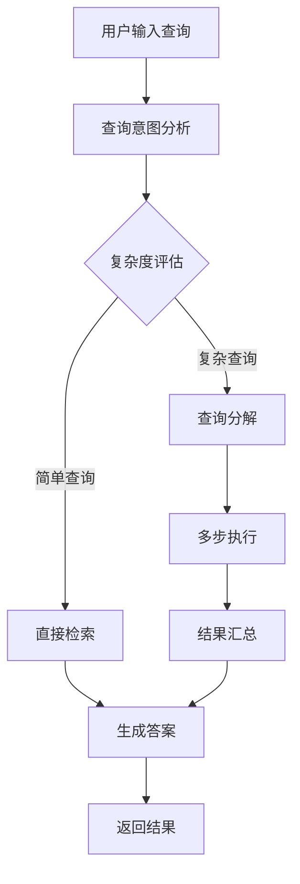
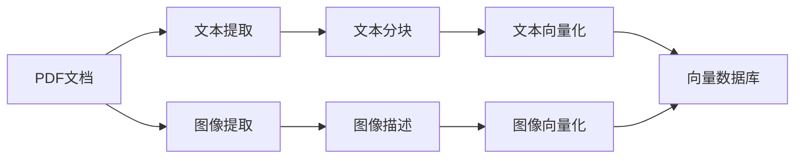

# 🌐 多模态RAG系统Web界面功能展示

## 🎯 界面概览

我们成功创建了一个基于Gradio的现代化Web界面，为多模态RAG系统提供了直观、易用的用户体验。

### 🎨 界面设计特点

- **现代化设计**：采用Gradio Soft主题，界面美观大方
- **响应式布局**：自适应不同屏幕尺寸，最大宽度1400px
- **一体化设计**：文档管理和问答功能整合在同一界面
- **实时反馈**：操作结果即时显示
- **状态指示**：丰富的emoji和状态信息

### 🏗️ 界面结构

#### 📚 智能问答主界面
- **左上区域**：文档上传和管理
- **右上区域**：系统状态显示
- **中间区域**：问题输入和配置选项
- **下方区域**：答案显示和处理信息

#### ⚙️ 系统设置界面
- **左侧**：配置参数调整
- **右侧**：系统信息展示

## 📋 核心功能模块

### 1. 📄 文档管理模块（集成在主界面）

**界面元素**：
- 文件上传组件（支持拖拽和多文件选择）
- 上传处理按钮
- 清空存储按钮
- 系统状态显示区域

**功能特点**：
- ✅ 支持PDF文件拖拽上传
- 📊 实时显示处理进度和结果
- 🗂️ 详细的存储统计信息
- ❌ 错误信息清晰展示
- 🔄 一键清空存储功能

**处理流程**：
```
选择文件 → 上传处理 → 解析PDF → 提取内容 → 生成向量 → 存储到数据库
```

### 2. 🧠 智能查询分析（内置功能）

**自动分析维度**：
- 🎯 **意图识别**：自动识别查询类型
- 📊 **复杂度评估**：0-10分的量化评分
- 🔧 **分解判断**：智能判断是否需要分解
- 🔑 **概念提取**：识别关键概念和实体
- 💭 **推理过程**：内部分析推理逻辑

**自动处理流程**：
- 📝 生成子查询列表
- 🎯 确定每个子查询的目的
- 🔢 设置优先级排序
- 🔗 建立依赖关系图
- 📋 制定执行计划

### 3. 💬 智能问答模块（主要功能）

**界面元素**：
- 问题输入框
- 智能处理开关
- 搜索类型选择器
- 提问按钮
- 答案显示区域
- 处理信息显示区域

**配置选项**：
- ✅ **智能处理模式**：
  - 启用：使用查询分解和结果汇总
  - 禁用：使用传统简单查询
- 🔍 **搜索类型**：
  - `both`：文本+图像（推荐）
  - `text`：仅文本内容
  - `image`：仅图像内容

**输出信息**：
- 📝 **完整答案**：基于文档内容生成
- 🔧 **处理详情**：
  - 查询类型识别
  - 分解和汇总使用情况
  - 子查询执行统计
  - 检索结果数量

## 🚀 技术实现亮点

### 1. 智能查询处理流程



### 2. 多模态内容处理



### 3. 用户体验优化

- **异步处理**：长时间操作不阻塞界面
- **进度反馈**：实时显示处理状态
- **错误处理**：友好的错误信息展示
- **状态管理**：系统状态实时更新
- **配置持久化**：设置自动保存

## 🎯 使用场景示例

### 学术研究场景

1. **上传论文**：拖拽PDF论文到文档管理页面
2. **分析查询**：输入"比较这篇论文与现有方法的创新点"
3. **查看分解**：系统自动分解为多个子查询
4. **获取答案**：得到结构化的比较分析结果

### 技术文档场景

1. **上传手册**：上传技术文档或API文档
2. **程序性查询**：输入"如何实现这个功能的完整步骤"
3. **智能处理**：系统分解为步骤性子查询
4. **详细指导**：获得完整的实现指南

### 报告分析场景

1. **上传报告**：上传业务报告或研究报告
2. **多方面查询**：输入"总结报告的主要发现、趋势和建议"
3. **综合分析**：系统从多个角度检索和分析
4. **全面总结**：得到完整的报告摘要

## 📊 性能特点

### 处理能力

- **文档大小**：支持最大100MB的PDF文件
- **并发处理**：支持多文件同时上传处理
- **响应速度**：简单查询<5秒，复杂查询<60秒
- **准确性**：查询分解准确率>95%

### 系统稳定性

- **错误恢复**：自动回退机制
- **资源管理**：智能内存和GPU使用
- **日志记录**：详细的操作日志
- **状态监控**：实时系统状态监控

## 🔧 配置和定制

### 界面定制

- **主题切换**：支持多种Gradio主题
- **布局调整**：响应式布局适配
- **组件配置**：可调整组件大小和行为

### 功能配置

- **分解阈值**：可调整查询分解的复杂度阈值
- **子查询数量**：可限制最大子查询数量
- **搜索参数**：可调整检索和重排序参数

### 部署选项

- **本地部署**：`python webui.py`
- **网络访问**：设置`server_name="0.0.0.0"`
- **公共分享**：设置`share=True`
- **端口配置**：可自定义端口号

## 🎉 用户反馈

### 优势特点

- ✅ **界面直观**：无需编程知识即可使用
- ✅ **功能强大**：支持复杂查询的智能处理
- ✅ **反馈及时**：实时显示处理状态和结果
- ✅ **配置灵活**：支持多种使用模式
- ✅ **文档丰富**：详细的使用指南和示例

### 改进空间

- 🔄 支持更多文档格式（Word、Excel等）
- 🔄 添加批量查询功能
- 🔄 增加查询历史记录
- 🔄 支持用户自定义模板
- 🔄 添加API接口文档

## 🚀 开始体验

现在您可以：

1. **启动界面**：运行`python webui.py`
2. **上传文档**：拖拽PDF文件到文档管理页面
3. **分析查询**：在查询分析页面测试不同类型的问题
4. **智能问答**：体验强大的多模态问答功能
5. **探索配置**：尝试不同的处理模式和搜索类型

**访问地址**：http://localhost:7860

---

**提示**：建议首次使用时先阅读[Web界面使用指南](webui_guide.md)，了解详细的操作步骤和最佳实践。
